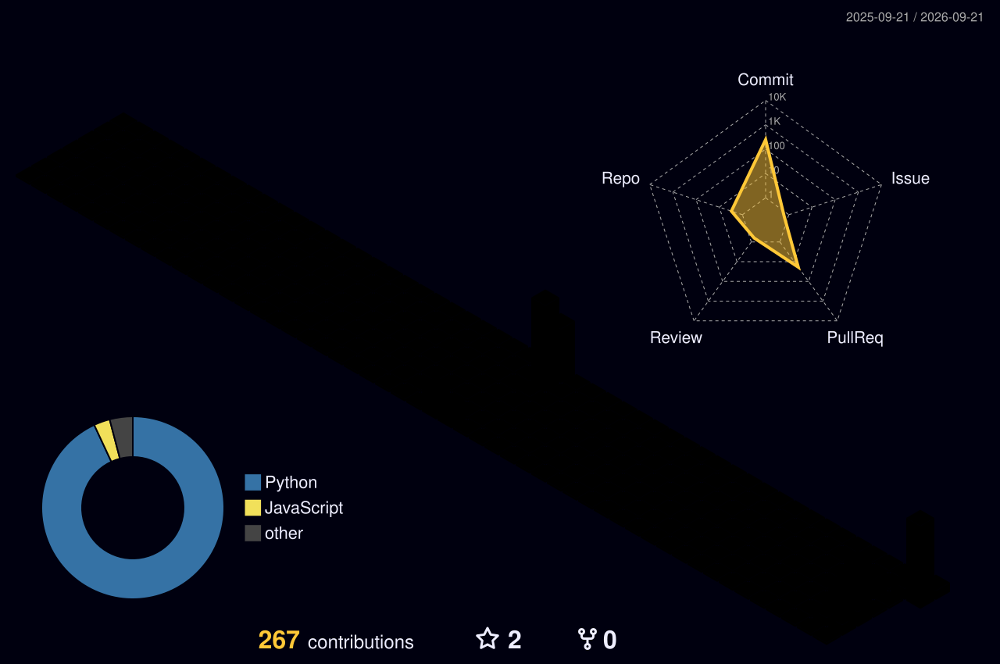

<div align="center">


<br/><br/>

<a href="https://www.linkedin.com/in/parth-komalwad-b482a71b0/"></a>&nbsp;
<a href="mailto:pkomalwad@gmail.com"></a>&nbsp;
<a href="https://twitter.com/KomalwadParth"></a>

<br/><br/>

```text
I design and ship production Generative AI systems.
Agents that do real work. Retrieval that stays grounded. Data platforms built for LLMs.
```

</div>


<div align="center">

</div>

<div align="center">
<table>
<tr>
<td align="center" width="25%">
<br/><br/>
<b>Agentic Systems</b><br/>
<sub>Multi-agent orchestration, handoffs, structured outputs, MCP</sub>
</td>
<td align="center" width="25%">
<br/><br/>
<b>Retrieval</b><br/>
<sub>RAG, GraphRAG, vector search, semantic layers</sub>
</td>
<td align="center" width="25%">
<br/><br/>
<b>Models</b><br/>
<sub>Llama 3 fine-tuning, NL2SQL, prompt engineering</sub>
</td>
<td align="center" width="25%">
<br/><br/>
<b>Platform</b><br/>
<sub>Azure AI, Microsoft Fabric, Docker, air-gapped deploys</sub>
</td>
</tr>
</table>
</div>


<div align="center">

</div>

<div align="center">

<br/>
<br/>


<br/>


</div>


<div align="center">

</div>

<div align="center">

<a href="https://github.com/Parthkomalwad/Sable"></a>

<b>The shell that asks first.</b>

<sub>SSH in and type English. Sable plans the work, previews every command, gates anything<br/>destructive behind a typed YES, hands long jobs to sandboxed sub-agents,<br/>and turns repeated work into reusable skills.</sub>

<br/><br/>


<br/><br/>

<a href="https://github.com/Parthkomalwad/Sable">

</a>

</div>

<br/>

<div align="center">

</div>

<div align="center">

<table>
<tr>
<td align="center" width="50%">

<a href="https://github.com/Parthkomalwad/VeritasChain">

</a>

<sub>Hash any file, pin it to IPFS, anchor the fingerprint on-chain with wallet and timestamp.<br/>Tamper-proof provenance, no accounts, no file storage.</sub>

<br/><br/>


</td>
<td align="center" width="50%">

<a href="https://github.com/Parthkomalwad/Archon">

</a>

<sub>Automated database backups as a drop-in Docker sidecar.<br/>AES-256 encrypted, SHA-256 verified, zero code changes to your app.</sub>

<br/><br/>


</td>
</tr>
</table>

</div>


<div align="center">

</div>

<div align="center">


<br/><br/>

<picture>
  <source media="(prefers-color-scheme: dark)" srcset="profile-3d-contrib/profile-night-rainbow.svg" />
  <source media="(prefers-color-scheme: light)" srcset="profile-3d-contrib/profile-green-animate.svg" />
  
</picture>

<br/><br/>


</div>

<br/>


