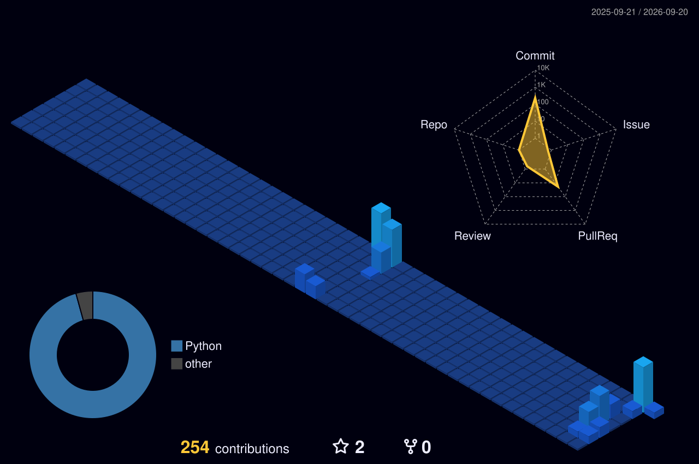

 

<table width="100%">
<tr>
<td width="46%" valign="top">

**Focus**

Agentic systems &nbsp;·&nbsp; multi-agent orchestration, structured outputs, MCP 
Retrieval &nbsp;·&nbsp; RAG, GraphRAG, vector search, semantic layers 
Models &nbsp;·&nbsp; Llama 3 fine-tuning, NL2SQL, prompt engineering 
Platform &nbsp;·&nbsp; Azure AI, Microsoft Fabric, Docker, air-gapped deploys

</td>
<td width="54%" valign="top" align="right">

**Stack**

 

LangChain · Anthropic · OpenAI · Ollama · Neo4j · pgvector · DuckDB · Parquet

</td>
</tr>
</table>

Currently building <b>Sable</b>, a Linux login shell that plans work from plain English, previews every command, and gates anything destructive behind a typed YES.

  

  

<picture>
  <source media="(prefers-color-scheme: dark)" srcset="profile-3d-contrib/profile-night-view.svg" />
  <source media="(prefers-color-scheme: light)" srcset="profile-3d-contrib/profile-green.svg" />
  
</picture>

Anthropic MCP certified &nbsp;·&nbsp; Neo4j Certified Professional

