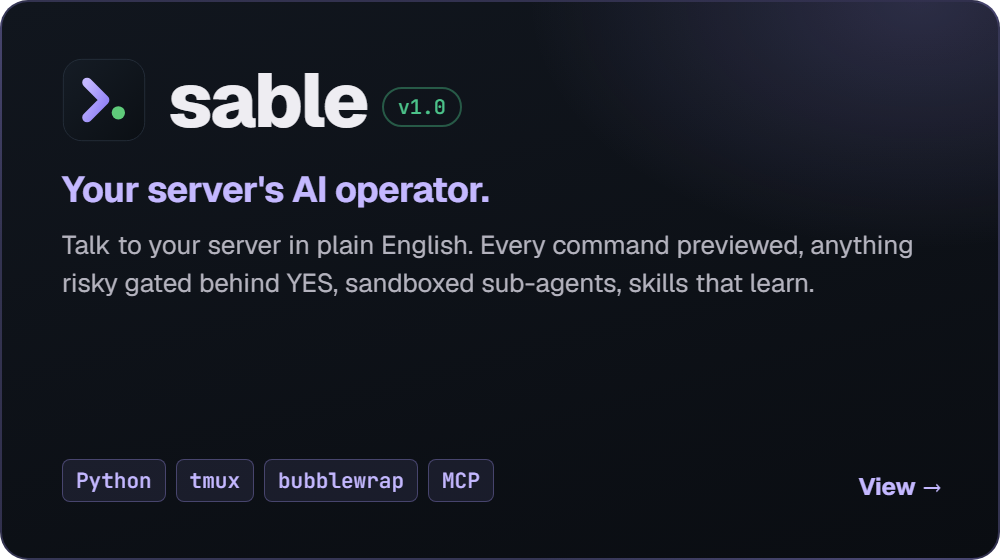
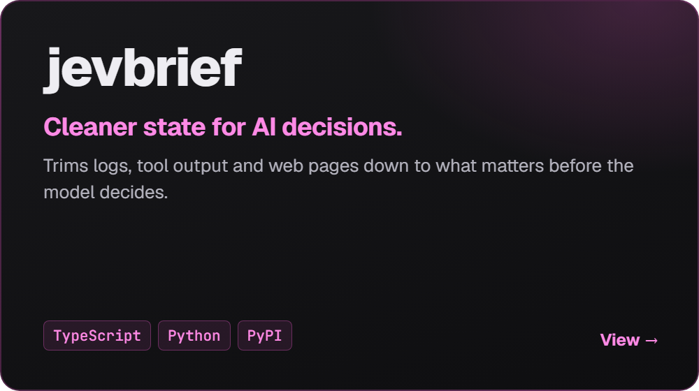
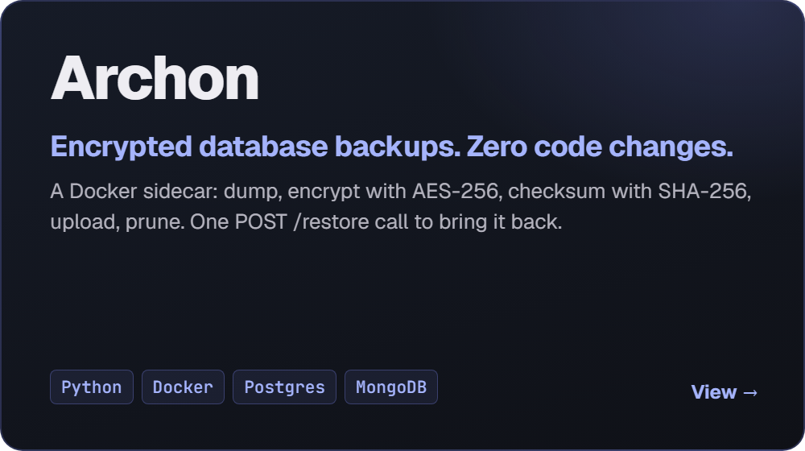
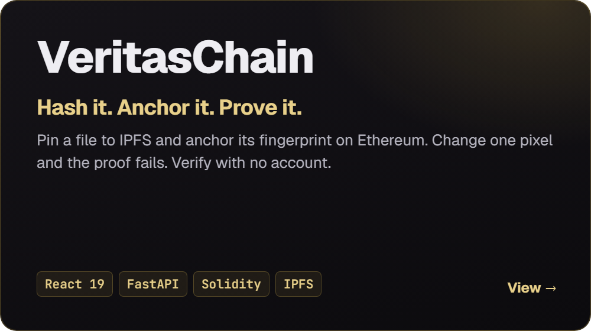
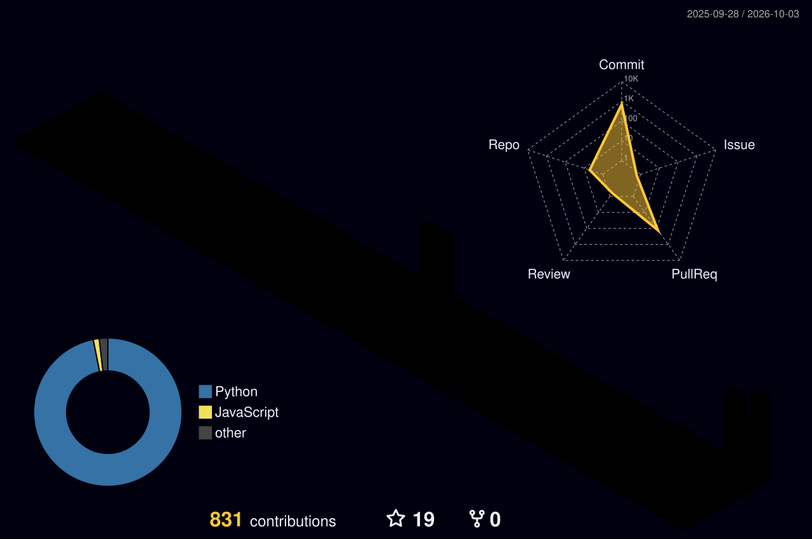

&nbsp;
&nbsp;
&nbsp;

  

I build agents that do real work, and write down how they break.

 

 

<table>
<tr>
<td width="50%"></td>
<td width="50%"></td>
</tr>
<tr>
<td width="50%"></td>
<td width="50%"></td>
</tr>
</table>

<a href="https://parthkomalwad.dev"><b>All projects and write-ups on parthkomalwad.dev &rarr;</b></a>

| | |
|---|---|
| **Agents & LLMs** | Multi-agent orchestration · RAG · GraphRAG · NL2SQL · MCP · Llama 3 fine-tuning · LangChain · Claude · OpenAI · Ollama |
| **Data** | Postgres · pgvector · DuckDB · Neo4j · Parquet · Microsoft Fabric |
| **Cloud & Ops** | Azure AI Foundry · AWS · Docker · GitHub Actions · air-gapped deploys |
| **Code** | Python · FastAPI · TypeScript · React 19 · WebAssembly |

  

 

<picture>
  <source media="(prefers-color-scheme: dark)" srcset="profile-3d-contrib/profile-night-rainbow.svg" />
  <source media="(prefers-color-scheme: light)" srcset="profile-3d-contrib/profile-green-animate.svg" />
  
</picture>

 

Open to conversations about agent systems, RAG, and AI platform roles &middot; <a href="mailto:pkomalwad@gmail.com">pkomalwad@gmail.com</a>

