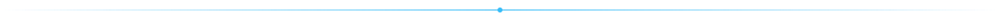

&nbsp;
&nbsp;
&nbsp;

 

**Senior AI Engineer · Pune, India** 
I build agents that do real work, and write down how they break.

 ▲ <b><a href="https://github.com/Parthkomalwad/Sable">Sable</a></b>, the shell that asks first. What I'm building now.

### 🛠️ Projects

<table>
<tr>
<td>

#### 🐚 [Sable](https://github.com/Parthkomalwad/Sable) &nbsp;`flagship` · `active`

**The shell that asks first.** SSH in and type English. Sable plans the work, previews every command, gates anything destructive behind a typed `YES`, runs long jobs in sandboxed sub-agents, and turns repeated work into reusable skills.

<!-- Demo GIF: record one (e.g. with vhs or asciinema + agg), commit it to the Sable repo at docs/assets/demo.gif, then uncomment:

-->

  

[**Read the docs →**](https://parthkomalwad.dev/projects/sable/) &nbsp;·&nbsp; [**Source →**](https://github.com/Parthkomalwad/Sable)

</td>
</tr>
</table>

**Also built**

- ✂️ **[jevbrief](https://github.com/Parthkomalwad/jevbrief)**: trims logs, tool output and web pages down to what matters before the model decides. TypeScript · Python · [docs](https://parthkomalwad.dev/projects/jevbrief/)
- 🗄️ **[Archon](https://github.com/Parthkomalwad/Archon)**: encrypted, verified DB backups as a drop-in Docker sidecar. Python · Docker · Postgres · MongoDB · [docs](https://parthkomalwad.dev/projects/archon/)
- 🔗 **[VeritasChain](https://github.com/Parthkomalwad/VeritasChain)**: hash a file, pin it to IPFS, and anchor the fingerprint on-chain. React 19 · FastAPI · Solidity · [docs](https://parthkomalwad.dev/projects/veritaschain/)

All projects and write-ups → **[parthkomalwad.dev](https://parthkomalwad.dev)**

### 🧰 Stack

| | |
|---|---|
| **Agents & LLMs** | Multi-agent orchestration · RAG · GraphRAG · NL2SQL · MCP · Llama 3 fine-tuning · LangChain · Claude · OpenAI · Ollama |
| **Data** | Postgres · pgvector · DuckDB · Neo4j · Parquet · Microsoft Fabric |
| **Cloud & Ops** | Azure AI Foundry · AWS · Docker · GitHub Actions · air-gapped deploys |
| **Code** | Python · FastAPI · TypeScript · React 19 · WebAssembly |

  

<picture>
  <source media="(prefers-color-scheme: dark)" srcset="profile-3d-contrib/profile-night-rainbow.svg" />
  <source media="(prefers-color-scheme: light)" srcset="profile-3d-contrib/profile-green-animate.svg" />
  
</picture>

Open to conversations about agent systems, RAG, and AI platform roles. Reach me at <a href="mailto:pkomalwad@gmail.com">pkomalwad@gmail.com</a>.

